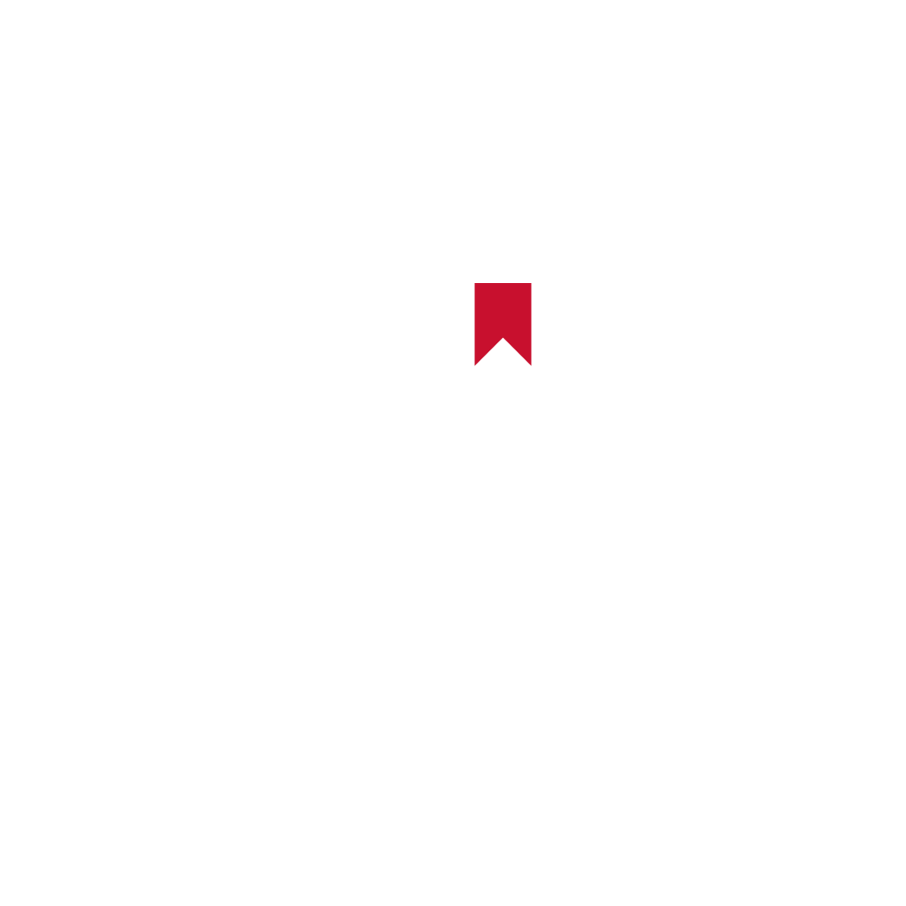

<div align="center">
<a target="_blank" href="https://play.google.com/store/apps/details?id=com.monospace.notes" title="Notes on Google Play">

</a>

# <samp>Notes<samp>

<samp>Organize your ideas easily with Notes!<samp>
<br>

[](https://crowdin.com/project/monospace-notes)

</div>

<br />

## <samp>Features<samp>

-   <samp>Markdown notes with a live formatting preview.<samp>
-   <samp>Math formulas (LaTeX) and footnotes.<samp>
-   <samp>Find and replace text inside a note.<samp>
-   <samp>Organize notes with tags.<samp>
-   <samp>Templates with placeholders to start new notes quickly.<samp>
-   <samp>Search with filters (tags, pinned, images, dates) and saved searches.<samp>
-   <samp>Pin, duplicate, export and share notes.<samp>
-   <samp>Multiple repositories (folders on your device) with subfolders.<samp>
-   <samp>Version history to restore previous edits.<samp>
-   <samp>Import existing Markdown notes.<samp>
-   <samp>Light and dark themes with accent colors.<samp>
-   <samp>Haptic feedback.<samp>
-   <samp>Available in 15 languages.<samp>
-   <samp>Minimalist and easy to use UI.<samp>

## <samp>Free vs Pro<samp>

| <samp>Feature<samp> | <samp>Free<samp> | <samp>Pro<samp> |
| --- | --- | --- |
| <samp>Repositories<samp> | <samp>1<samp> | <samp>Unlimited<samp> |
| <samp>Subfolders per repository<samp> | <samp>1<samp> | <samp>Unlimited<samp> |
| <samp>Version history<samp> | <samp>Last 5 versions<samp> | <samp>Full, unlimited<samp> |
| <samp>Accent colors<samp> | <samp>White only<samp> | <samp>All colors<samp> |

## <samp>Download<samp>

<a href="https://play.google.com/store/apps/details?id=com.monospace.notes">

</a>

## <samp>Built with<samp>

   

## <samp>How to contribute<samp>

1.  <samp>Fork the repository.<samp>
2.  <samp>Clone the forked repository.<samp>
3.  <samp>Install dependencies with npm.<samp>

```bash
npm install
```

4. <samp>Connect your Android device to your computer via a USB cable.<samp>

5. <samp>Run the project with Expo Go, if you don't have it installed, it will be installed automatically.<samp>

```bash
npx expo start
```

6. <samp>Make changes and create a pull request.<samp>

## <samp>Translations<samp>

-   <samp>Help us translate the app to your language.<samp>
-   <samp>Join the translation project on [Crowdin](https://crowdin.com/project/monospace-notes).<samp>
