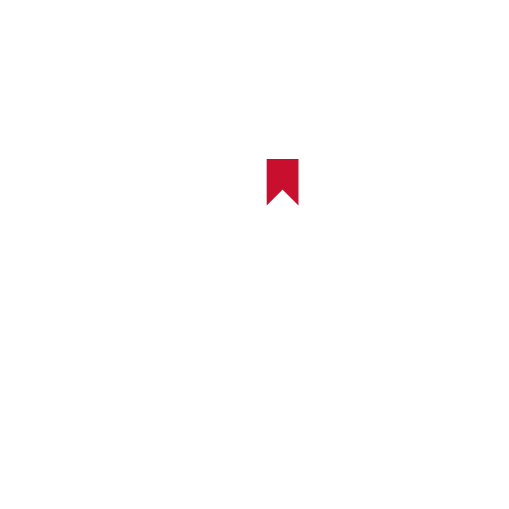

<div align="center">
<a target="_blank" href="https://play.google.com/store/apps/details?id=com.monospace.notes" title="Notes on Google Play">

</a>

# <samp>Notes<samp>

<samp>Organize your ideas easily with Notes!<samp>
<br>

[](https://crowdin.com/project/monospace-notes)

</div>

<br />

## <samp>Features<samp>

-   <samp>Markdown notes with three modes: read, live formatting and raw code.<samp>
-   <samp>Obsidian-compatible syntax: callouts, highlights, comments, math (LaTeX), footnotes, task lists (including custom statuses such as <code>[/]</code> and <code>[-]</code>), inline footnotes and tables.<samp>
-   <samp>Properties panel for frontmatter (tags, aliases, text, numbers, dates, date and time, lists and checkboxes).<samp>
-   <samp>Wiki links with aliases, links to headings and blocks, and links within the same note.<samp>
-   <samp>Embeds of notes, headings, blocks and images with a button to open the original note, and autocomplete for links and block ids.<samp>
-   <samp>Backlinks, unlinked mentions and automatic link updates when you rename a note or a heading.<samp>
-   <samp>Outline of the note's headings and a panel of outgoing links.<samp>
-   <samp>Attachments: images, audio, video and PDFs.<samp>
-   <samp>Nested tags, advanced search (negation, <code>OR</code>, phrases, regex, <code>line:</code>, <code>task:</code>, property queries, date ranges and the <code>tag:</code>, <code>path:</code>, <code>is:pinned</code>, <code>has:image</code> operators), saved and recent searches.<samp>
-   <samp>Find and replace text inside a note, and indent or outdent list items from the toolbar.<samp>
-   <samp>Templates with placeholders and a daily note.<samp>
-   <samp>Sort notes by name, modification date or creation date.<samp>
-   <samp>Pin, duplicate, export (Markdown, HTML and PDF) and share notes.<samp>
-   <samp>Multiple repositories (folders on your device) with subfolders.<samp>
-   <samp>Version history to restore previous edits.<samp>
-   <samp>Import existing Markdown notes.<samp>
-   <samp>Light and dark themes with accent colors, adjustable font size and line width.<samp>
-   <samp>Available in 15 languages.<samp>
-   <samp>Minimalist and easy to use UI.<samp>

## <samp>Free vs Pro<samp>

| <samp>Feature<samp> | <samp>Free<samp> | <samp>Pro<samp> |
| --- | --- | --- |
| <samp>Repositories<samp> | <samp>1<samp> | <samp>Unlimited<samp> |
| <samp>Subfolders per repository<samp> | <samp>1<samp> | <samp>Unlimited<samp> |
| <samp>Version history<samp> | <samp>Last 5 versions<samp> | <samp>Full, unlimited<samp> |
| <samp>Accent colors<samp> | <samp>White only<samp> | <samp>All colors<samp> |
| <samp>HTML and PDF export<samp> | <samp>-<samp> | <samp>Included<samp> |

## <samp>Download<samp>

<a href="https://play.google.com/store/apps/details?id=com.monospace.notes">

</a>

## <samp>Built with<samp>

   

## <samp>How to contribute<samp>

1.  <samp>Fork the repository.<samp>
2.  <samp>Clone the forked repository.<samp>
3.  <samp>Install dependencies with npm.<samp>

```bash
npm install
```

4. <samp>Connect your Android device to your computer via a USB cable.<samp>

5. <samp>Run the project with Expo Go, if you don't have it installed, it will be installed automatically.<samp>

```bash
npx expo start
```

6. <samp>Make changes and create a pull request.<samp>

## <samp>Translations<samp>

-   <samp>Help us translate the app to your language.<samp>
-   <samp>Join the translation project on [Crowdin](https://crowdin.com/project/monospace-notes).<samp>
