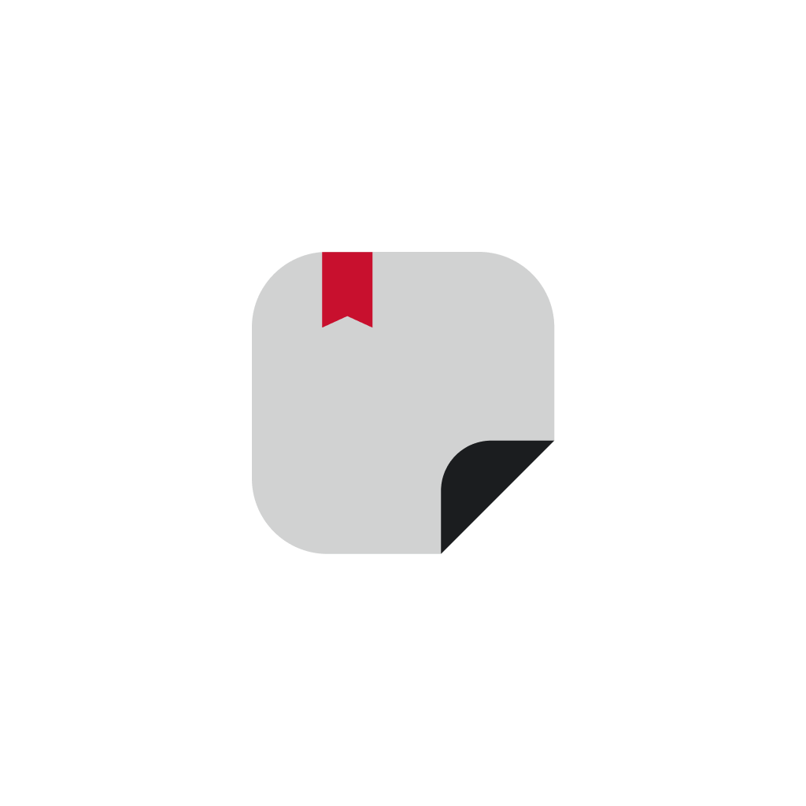

<div align="center">
<a target="_blank" href="https://play.google.com/store/apps/details?id=com.monospace.notes" title="Notes on Google Play">

</a>

# <samp>Notes<samp>

<samp>Organize your ideas easily with Notes!<samp>
<br>

[](https://crowdin.com/project/monospace-notes)

</div>

<br />

## <samp>Features<samp>

-   <samp>Add notes with images.<samp>
-   <samp>Organized with categories.<samp>
-   <samp>Password and fingerprint security.<samp>
-   <samp>Haptic feedback.<samp>
-   <samp>Minimalist and easy to use UI.<samp>

## <samp>Download<samp>

<a href="https://play.google.com/store/apps/details?id=com.monospace.notes">

</a>

## <samp>Built with<samp>

   

## <samp>How to contribute<samp>

1.  <samp>Fork the repository.<samp>
2.  <samp>Clone the forked repository.<samp>
3.  <samp>Install dependencies with npm.<samp>

```bash
npm install
```

4. <samp>Connect your Android device to your computer via a USB cable.<samp>

5. <samp>Run the project with Expo Go, if you don't have it installed, it will be installed automatically.<samp>

```bash
npx expo start
```

6. <samp>Make changes and create a pull request.<samp>

## <samp>Translations<samp>

-   <samp>Help us translate the app to your language.<samp>
-   <samp>Join the translation project on [Crowdin](https://crowdin.com/project/monospace-notes).<samp>
